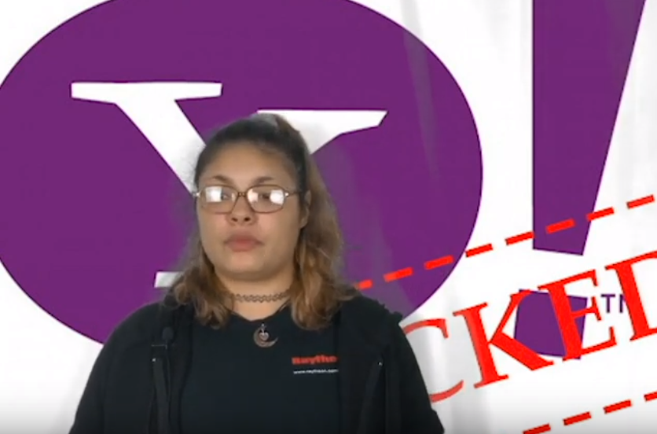

Click on the image below in order to go to the YouTube video!

Hi Everyone! My name is Helene and welcome to the first video of its kind on my channel. I’ve recently graduated from college this past August with a degree in Computer Science and I’ve tried to focus my studies toward cybersecurity-related topics. I basically took every cybersecurity-related course that my school offered.

The best part? My former school started a cybersecurity major this fall. I’m not salty.

Anyway, I’ve decided to start talking about different cybersecurity-related issues, breaches, and other topics related to Computer Science in order to inform you all on how to protect ourselves and hopefully during the next breach that will inevitably happen, you will be more secure during the average user.

Now onto the insane Yahoo hacks that have occurred over the past 5 years. 

In 2014 a Latvian hacker, Aleksey Belan, who was hired by Russia issued a spear-phishing attack against Yahoo sever employees. You’ve likely heard of phishing which is the act of trying to gain unauthorized access to an organization by nefarious means. Usually by sending emails with links that can easily infect a system with a virus or some other nefarious software. All it takes is one person to click the link in order to get infected. 

Spear Phishing as the name implies is targeted phishing because of the nature of what these hackers were trying to obtain, they went after certain individuals who had the right access levels and were able to gain elevated access. 

Aleksey was able to find the yahoo user database and the account management tool which is used to edit the database. This database contained names, phone numbers, hashed passwords, password challenge questions and answers, password recovery emails and cryptographic values unique to each account. Once he found these, he copied about 500 million accounts over to his personal equipment in order to gain information from this data he collected.

One of the biggest issues was the way Yahoo stored their passwords. The majority of the passwords were stored using the bcrypt hashing algorithm which is incredibly difficult to brute force and makes it difficult to use rainbow tables when trying to get the unhashed value. The rest were stored as MD5 which is multitudes easier because it has several different security weaknesses.

I will be talking more about hashes in another video so, stay tuned for that. Just know MD5 is bad for hashing passwords.

Next, is the issue with the uniques cryptographic values connected with each account which are also known as Nonces. These cryptographic values are just arbitrary numbers that only used once within cryptographic communication and are used to avoid certain attacks such as replay attacks which is an attack in which a valid transmission is intercepted and then fraudulently delays or resends the transmission in order to do what an attacker wants.

Since they have this value, it is easy to generate a cookie through a script that the hackers left on the Yahoo server. This gave the hackers free access to a user email without the need for a password.

Given that they also had access to the password recovery emails, they could easily gain access to other accounts connected to the recovery email as well because most people tend to put the same questions and answers to their password recovery tools. 

The hacked users included an assistant to the deputy chairman of Russia, an officer in Russia's Ministry of Internal Affairs and a trainer working in Russia's Ministry of Sports. Others belonged to Russian journalists, officials of states bordering Russia, U.S. government workers, an employee of a Swiss Bitcoin wallet company and a U.S. airline worker.

Yahoo didn’t find out about this hack until late 2014 and initially thought only 26 accounts were affected, so they went to the FBI with this information. In August of 2016, the FBI found that over 500 million accounts had been affected by this hack alone.

A month prior to this, account names and passwords for about 200 million Yahoo accounts were for sale on the deep web market site “The Real Deal”. Peace_of_Mind stated the data likely dates back to 2012, and security experts believed it may have been parts of other data hacks at that time.  This is when it was concluded that there was a data breach in August of 2013 which affect 1 billion of its users. You heard that right.

In December of 2016, Yahoo finally announced the hacks and forced all of its users to change their passwords. Then in 2017, Yahoo announced that the number of accounts compromised was even larger: 3 billion in all. Which is every single user that Yahoo had at the time. 

This is why I’m making my own email server; I don’t trust anyone.

It was discovered that the offered data included the accounts of over 150,000 names of people working for the United States government and military, as well as additional accounts associated with the European Union, Canadian, British, and Australian governments.

Hold Security, found that as late as October of 2016, there were some sellers still selling the database for as much of $200,000. While the passwords are likely invalid by now, some of the data can still be used to affect users who entrusted Yahoo with their information. Their password recovery email can be used to implement a phishing attack and gain access to other accounts.

We will likely still be seeing the effects of this hack for years to come.

Yahoo recently set up a $117.5 million dollar fund for those who had a Yahoo account between 2012 and 2016 and will pay up $358 or offer a credit monitoring service for up to a year. You’ll likely see a lot less than this amount if you were affected because they’ll only payout if you already have a credit monitoring service. I’ve left the link below to Yahoo’s instructions on how to file a claim.

Yahoo was slow in their response and this does not seem like proper compensation given the amount of data that has been leaked.

This isn’t the last time Yahoo would be hacked. A former Yahoo employee, Reyes Daniel Ruiz, copped to a computer intrusion charge for using his work access to crack the passwords of roughly 6,000 yahoo accounts which were mostly accounts of younger women.

He even targeted his friends and coworkers; he made copies of their personal images and videos then stored them on his home computer. He has also admitted to compromising the iCloud, Gmail, DropBox, and other accounts of the Yahoo users in order to search for more explicit content. He faces up to 5 years in prison.

It seems like Yahoo, now owned by Verizon under the name Oath, (that's a whole other story in itself) can’t catch a break. This was really fun to research and I’ll be doing a lot of these in the future so, be sure to stick around by hitting the subscribe and like button if you like this video. 

I see you all in the next video.

