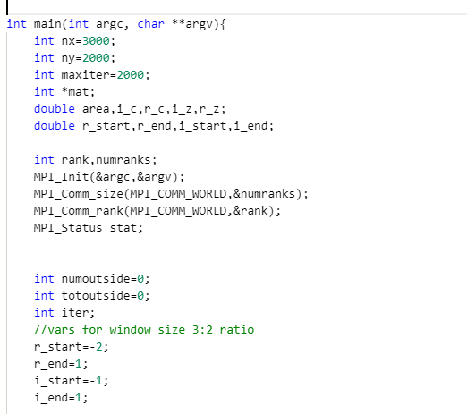
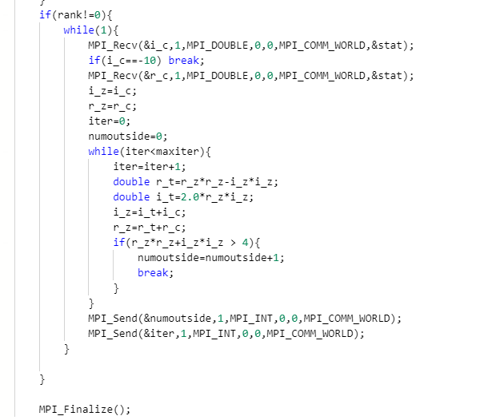

Last summer, I took a Parallel Computing course where we took simple programs (that you've probably completed over the course of your programmimg career) and "parallized" them or optimized them to make them run faster. Some of the projects we worked on included Conways Game of Life, Dot Products, Image Convolution and what we'll be talking about today - the Mandelbrot Set.

I orginally wrote the code in C because of it's usability with MPI, but if we're being honest the only other language we were allowed to write in was FORTRAN and I choose not to put myself through that kind of pain. 

Here is a big chunk of the most of the Mandelbrot logic. There is some MPI code in there so, for understandability just know that the *MPI_RECV*s recieve variables while the *MPI_SEND*s, send variables to different processes.





Recently, I have been working a lot with React which has caused me to challenge myself to write different programs, which normally wouldn't be written in Javascript, to be written in Javascript. I recently followed freeCodeCamps tutorial on Tetris in react (while putting my own spin on it) and it works *relatively* well.

The Mandelbrot set is a set of complex numbers, c, where the f(z) = z^2 + c does not diverge when z starts at 0. <a href = "https://en.wikipedia.org/wiki/Mandelbrot_set">Here</a> is a link to the wikapedia article that gives you some basic understandin of the Mandelbrot set, some host and some psuedocode to compute it. The thing that makes the Mandelbrot set so unique is that you can endlessly "zoom" into the picture which reveals new patterns.


Let's first talk about this mandelbrot function:

```javascript
    let MAXIUMUM_ITERATIONS = 255;

    function mandelbrot(ix, iy, rx, ry) {
        let n = 0;

        while((ix*ix + iy*iy) <= 4 && n < MAXIUMUM_ITERATIONS) {
            let z = ix*iy;
            ix = ix*ix - iy*iy + rx;
            iy = 2*z + ry;

            n += 1;
        }
        
        return n;
    }
```

This while loop is run a maximum of 255 timesfor each pixel in the image. Basically, the only way we will break out of the loop is if the absolute value of the complex number is greater than 4 or 255 has been hit. The iteration, n, is the number we want here beacsue this is what tells us what color to plot in order to see the fractal in an image.

Next, we have have to iterate over an image. For right now, instead of using something like canvas, I just used colored div's so, in order to achieve this, I just initialized an empty list called colors. The rx and ry values are used for zoom in and out of your image - the higher the value, the more zoomed in to the image you are.

```javascript
     function main() {

      let height = 400;
      let width = 400;

      for(let i = 0; i < width; i++) {
          for(let j = 0; j < height; j++) {
            //zooming in and out of the picture
            let rx = -2 + i/100;
            let ry = -2 + j/100;
            let ix = 0;
            let iy = 0;

            let ans = mandelbrot(ix, iy, rx, ry);
            if(ans === MAXIUMUM_ITERATIONS) {
              colors.push("black")
            }
            else if(ans < 255 && ans >= 10) {
              colors.push("red")
            }
            else if(ans < 10 && ans >= 5) {
              colors.push("green")
            }
            else if(ans < 5 && ans >= 3) {
              colors.push("orange")
            }
            else {
              colors.push("white")
            }
              
          }
      }
  }

```

In order to see some contrast in my image, I used different colors to represent certain ranges of values as shown above. So to color the divs, I used the map function to easily change the colors on the divs.

```javascript
let count = 0;
  const divList = colors.map((color) => {
    count++;
    if(count >= 400) {
      count = 0;
      return(<br/>)
    }

    if(color === 'white') {
      return(<div style = {{backgroundColor:'blue', display:'inline-block'}}>.</div>)
    }
    else if(color === 'red') {
      return(<div style = {{backgroundColor:'red', display:'inline-block'}}>.</div>)
    }
    else if(color === 'green') {
      return(<div style = {{backgroundColor:'green', display:'inline-block'}}>.</div>)
    }
    else if(color === 'orange') {
      return(<div style = {{backgroundColor:'orange', display:'inline-block'}}>.</div>)
    }
    else {
      return(<div style = {{backgroundColor:'white', display:'inline-block'}}>*</div>)
    }
  })
```

Below is a gif of what it ended up looking like.


In my next post, I will be making a actual image out of the Mandelbrot and give all of you an oppourtunity to download my code as well!