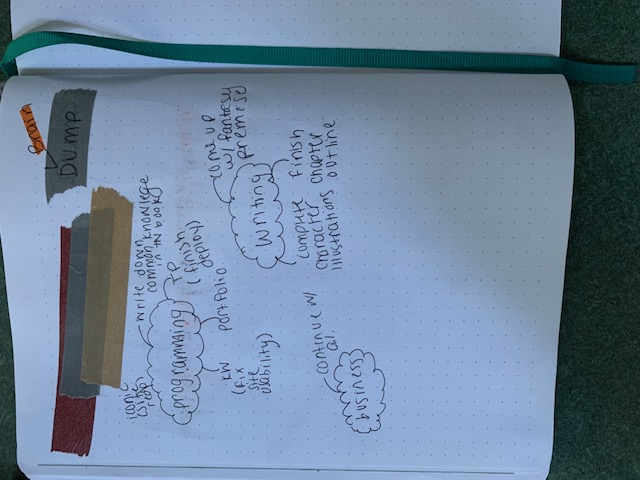

This past month has been an extremely busy one! I have also been trying to find a way to make my bullet journal work for me now that I am no longer in school. I thought that I would need more space for daily tasks, but the more menial things, I have found, that writing them down hinders me from actually doing it.

I created a new cover page for this new chapter in my life; everytime something changes in my life, I like to do something like this because it gives me a new percepective on the coming weeks.

I've decided to switch up the way I plan out my weeks. Below I have picture of what my weeks used to look like as I've decided to do this again because I've found it works well with what I am planning to accomplish in the coming months. This spread is EXTREMLY minimal, but was functional. 

As you can see, I've listed what I need to accomplish on the left page and then I used the right side to plan out my week. This also makes it easier to transfer over todo's from week to week. Here is one I used a few weeks ago that was more decorative. It wasn't as functional as I would have preferred which frusterated me and caused to to not use it.

So, I decided to have a mix between comfortable and decorative! (I started on Tuesday because Sunday was my birthday and I was still recovering from the weekend)

I also decided to do a brain dump page because I was feeling cluttered and disorganized so, I decieded to put it all down and organize in different spreads.

